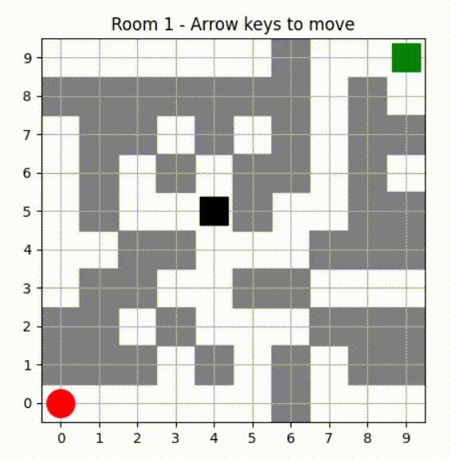
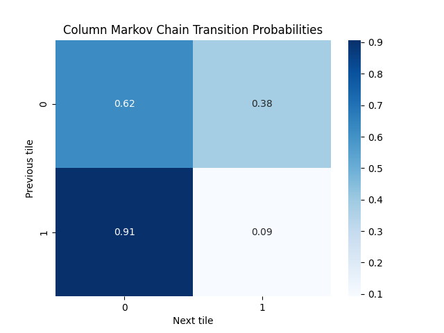
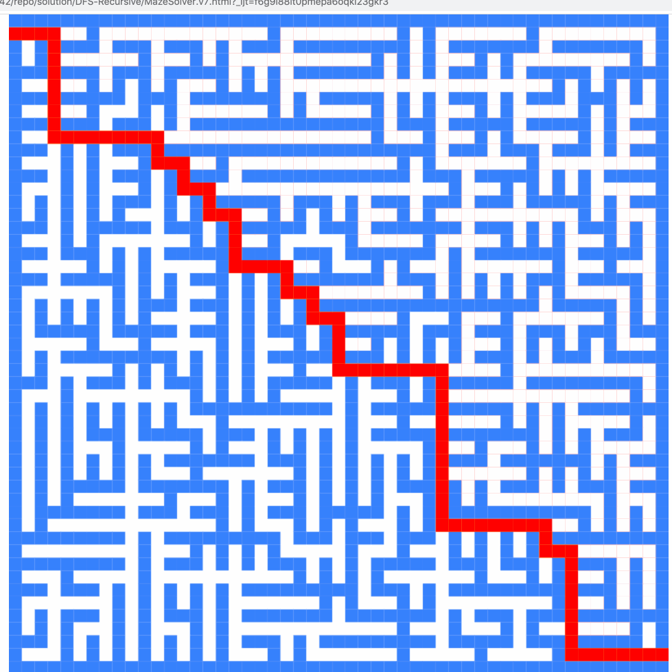

# markov-maze-adventure-game

### 1. Introduction

This project demonstrates a simple adventure game where you want to collect reward and avoid traps. For this kind of game, multiple different mazes are needed. They can be designed by hand, but it is time consuming. An alternative is to randomly generate them, which doesn't seem like a good solution since we want mazes to make sense. The better solution is to design a few mazes by hand, and generate the rest using **Markov's chains**. Also, valide each generated maze with **Breadth-first-search** algorithm, so every maze is solvable.

### 2. Markov chains

First, we will design a couple of maps to be the "training data" for the Markov chains. Each row is a sequence of 0s and 1s, representing empty spaces and walls. By providing a few examples, the Markov chain can learn local patterns, like how often walls follow other walls or empty spaces.

Mathematically, the Markov chain assumes the probability of the next cell depends only on the current cell (first-order Markov property). We are using the simplest form: P(next_tile | current_tile).
Here’s what happens:
We initialize chain as a nested dictionary: chain[prev][next] counts how many times a given state next follows prev in the examples.
For every sequence (row or column), we iterate through each pair of adjacent tiles. prev is the current tile, nxt is the next tile, and we increment the count.
After counting, we normalize the counts to probabilities: each next tile probability is divided by the total number of times prev appeared. This ensures the probabilities sum to 1:
This normalization is crucial for sampling with random.choices later.

Next, we define a function to generate a sequence of tiles using the Markov chain:We start with a 0 (empty tile) for simplicity.
For each new tile, we look at the previous tile prev.
nxt_probs contains the dictionary of probabilities for the next tile.
random.choices(choices, probs)[0] samples the next tile according to the probabilities from the Markov chain.
Mathematically, this is a stochastic process, where the state at time t+1 is randomly drawn according to P(next | current).

We can look at the probabilities for every state, what will the Markov chain choose:

### 3. Breadth-first-search

BFS explores all reachable empty tiles from the start.
visited keeps track of which cells we have already checked.
q stores the frontier of cells to explore.
For each cell (x, y), we check its four neighbors. If a neighbor is inside the grid, not visited, and not a wall, we add it to q.
If we reach the goal, the room is solvable. Otherwise, we return False.
Mathematically, BFS is a graph traversal algorithm. Each cell is a node, each empty neighbor is an edge, and BFS ensures that if a path exists from start to goal, it will find it.

### 4. Draw the maze

Each wall is drawn as a gray rectangle.
Player is a red circle, treasure a green square, trap a black square.
The grid coordinates are adjusted to center the rectangles in each cell.

### 5. Player movement

Player uses arrows on the keyboard to control the game. With that, we calculate the new position.
If it’s a wall, movement is blocked.
If the player reaches a treasure, the room advances (or game resets).
If the player hits a trap, the room restarts.
